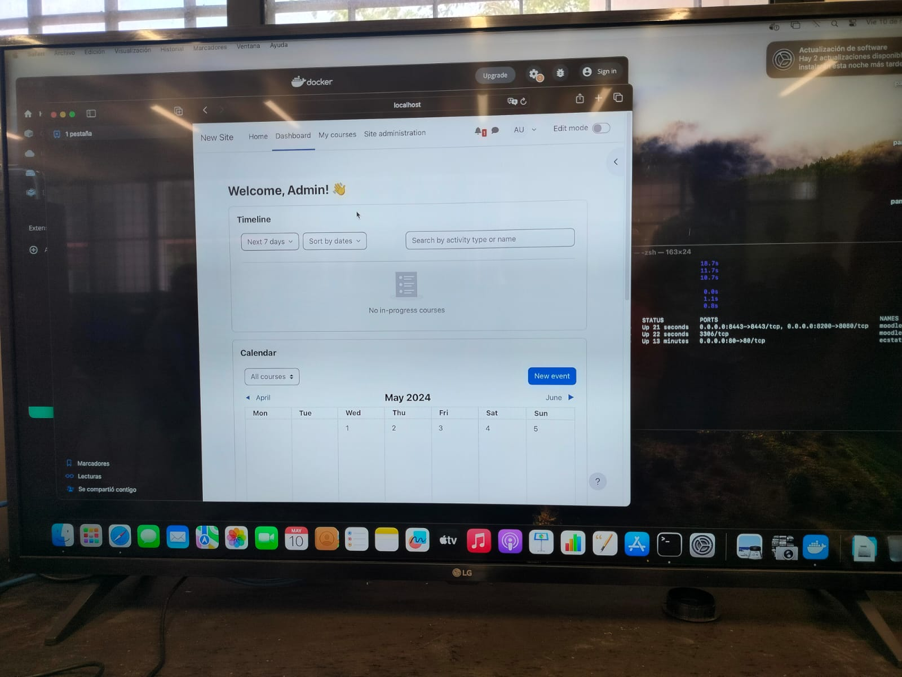
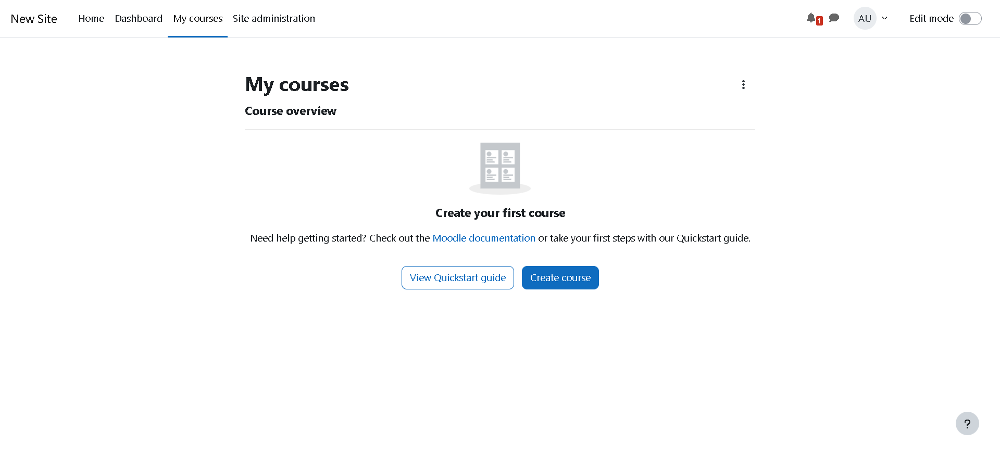
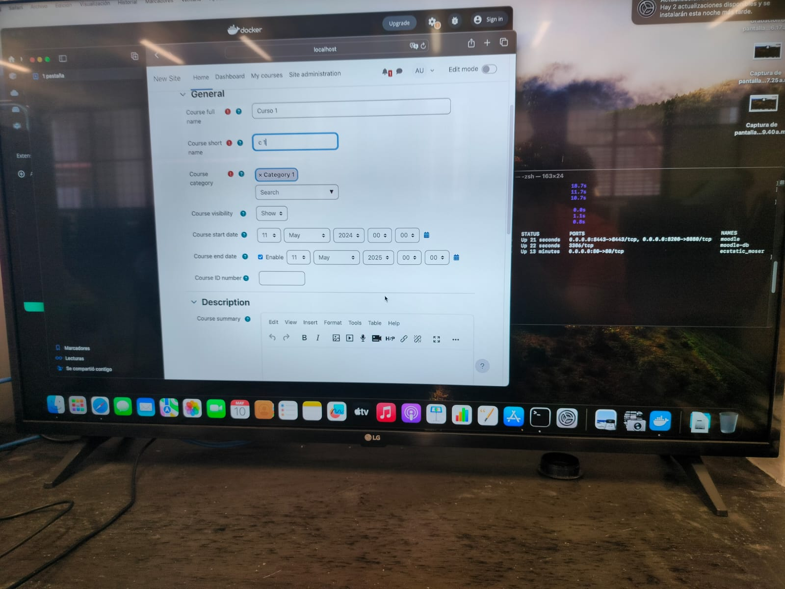
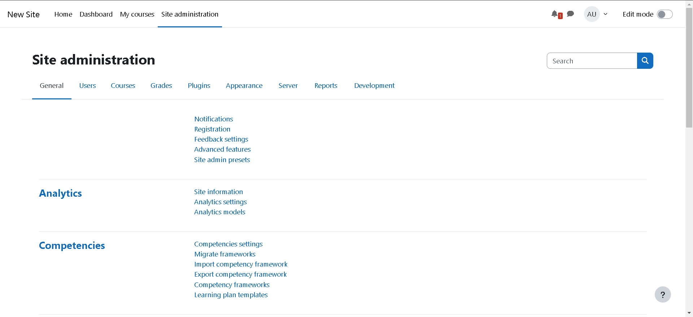
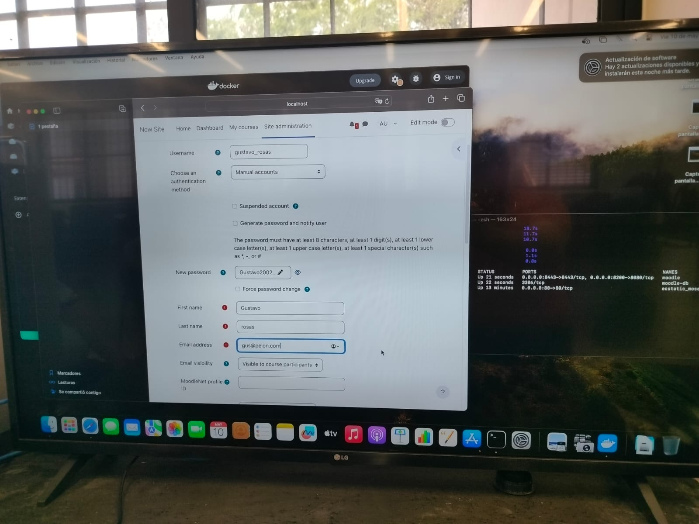
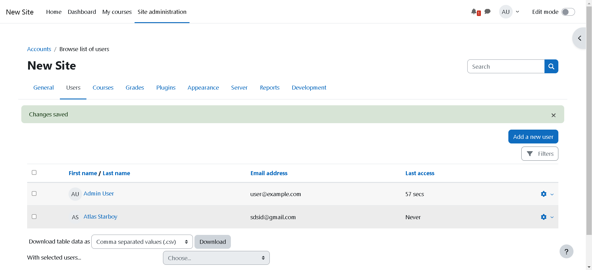
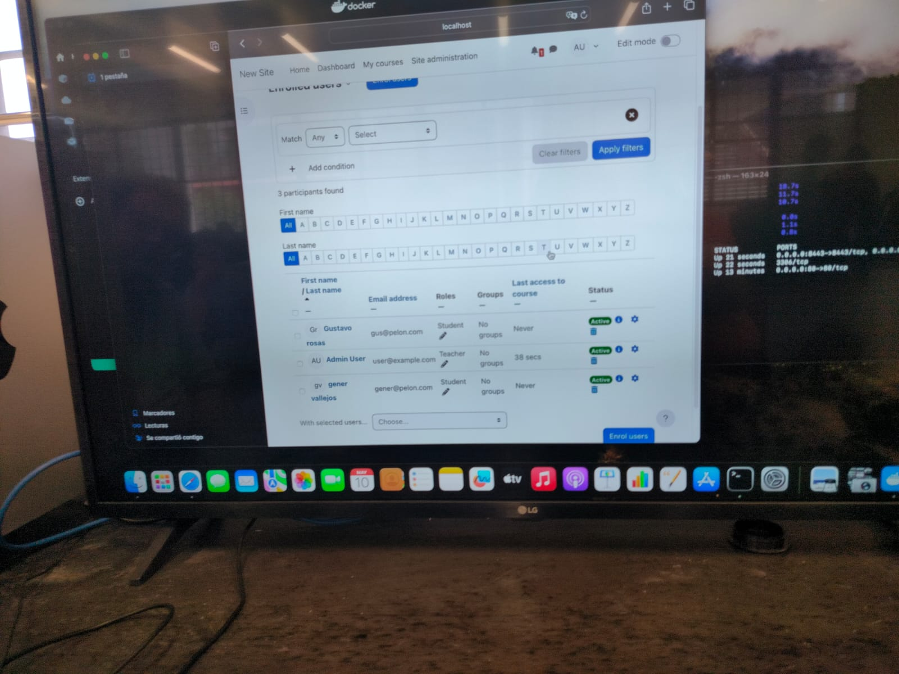

# DevOpsDockerComp
En este repositorio se encuentra el proceso para realizar la clonación del Moodle y los comandos para realizar el Docker Compose

# Procedimiento para clonar el Learning Management System (LMS) Moodle

1. Es necesario crear una carpeta en donde se almacenarán los datos del repositorio a clonar así como su base de datos

    ```perl
    mkdir docker
    ```

En este caso, se le puede poner el nombre que se desee.

2. Cambiarse al directorio o carpeta que se acaba de crear

    cd docker


3. Se clona el siguiente repositorio con el siguiente comando:

    git clone https://github.com/jmlcas/moodle


4. Cambiarse al directorio que se añade luego de clonar el repositorio

   cd moodle


5. Realizar el Docker compose con el siguiente comando:

   docker compose up -d

Es importante realizar el docker compose con el parámetro -d ya que sin él se corre el riesgo de echar a perder toda la configuración previa de docker que se ha realizado. La información que controla el usuario y la contraseña con la cual se accede al panel administrativo se encuentra en el archivo docker-compose.yml que se encuentra en el repositorio, en dicho archivo se realizan diferentes configuraciones y parámetros necesarios para que funcione el servicio sin ningún problema.

# Configurar Moodle

En este caso, primero se debe acceder al Moodle en el navegador, para ello se debe escribir en el buscador lo siguiente:

    localhost:8200 o bien laip:8200
    
A continuación, accedemos al Moodle utilizando el usuario y contraseña por defecto. Estos son:

Usuario: User
Password: p4ssw0rd

## Crear un curso

Inicialmente, inmediatamente después de loguearse, nos muestra el Dashboard o bien, el panel, como se muestra en la siguiente imagen



1. Para crear un curso es necesario dar clic en el apartado "My Courses", al hacerlo, se nos desplegará la siguiente pantalla:



2. Le damos clic a la opción "Create Course" y se nos despliega la siguiente pantalla:



3. Llenamos la información del curso y al finalizar le damos clic a "Save and Display"

## Crear usuarios

1. Como primer paso debemos seleccionar el apartado "Site administration" y se nos despliega la siguiente pantalla:



2. Posteriormente seleccionamos el apartado de "Users" y ya en esa pestaña seleccionamos la opción que dice "Add new user". Después de hacerlo se nos despliega la siguiente pantalla.



3. Ya en esta pantalla, llenamos la información que se nos solicita y al terminar damos clic a "Create User". Posteriormente nos mostrará la siguiente pantalla:



En esta misma pantalla tenemos la posibilidad de crear más usuarios.

## Inscribir participantes

1. Primeramente debemos de irnos a la pestaña "My Courses"
2. Posteriormente se selecciona el curso al que se requiere inscribir participantes.
3. Una vez adentro del curso seleccionamos la opción de "Participants".
4. Una vez dentro de esta pantalla seleccionamos la opción "Enroll users"
5. Finalmente, llenamos la información que se nos solicita y al concluir damos clic a "Enrol users"

La pantalla desplegada luego de inscribir participantes se debe ver así.




